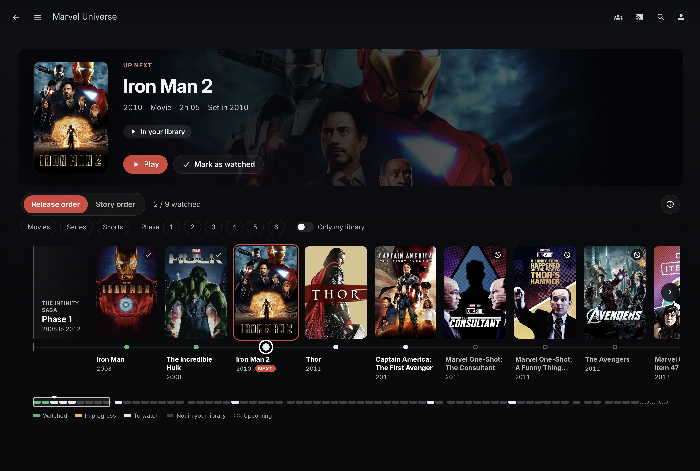

# MCU Timeline



A Jellyfin plugin that shows the whole Marvel Cinematic Universe on one timeline, in release or
story order. For the apps that cannot show the timeline, it can also keep a playlist for each
order and an MCU collection.

Works on Jellyfin 10.9, 10.10, 10.11 and 12. Each server gets the build made for its version.

## Install

The timeline page needs [Plugin Pages](https://github.com/IAmParadox27/jellyfin-plugin-pages)
and [File Transformation](https://github.com/IAmParadox27/jellyfin-plugin-file-transformation).
They have no build for Jellyfin 10.9, so there the plugin keeps the playlists and the
collection only.

1. In Dashboard, Plugins, Repositories, add
   ```
   https://raw.githubusercontent.com/KassFlute/jellyfin-plugin-mcu-timeline/main/manifest.json
   ```
2. Install **MCU Timeline** from the catalogue and restart Jellyfin.
3. In the plugin settings, under **Show in Jellyfin**, tick at least one option and save.
   Everything is off after install, so until then the MCU shows nowhere in Jellyfin.

## Settings

**Show in Jellyfin**, each on its own:

- **Timeline page**: the timeline, under Media in the side menu. Needs the two plugins above.
- **Release order playlist** and **Story order playlist**: every title, episodes included, in
  that order.
- **MCU collection**: every title in the library, unordered. It gets an MCU poster and
  backdrop, unless you pick other images in Jellyfin.

Saving creates what is ticked and deletes the playlists and the collection that are not. They
are kept up to date when the library changes, and once a day.

Other settings:

- **Libraries**: where to look for the titles.
- **Shorts** and **upcoming titles**: whether to include them.
- **Jellyseerr**: address and API key, to request missing titles.
- **Names**: playlist owner, playlist and collection names.

## Data

To change the timeline, copy
[`mcu-timeline.json`](src/Jellyfin.Plugin.McuTimeline/Data/mcu-timeline.json) to
`<config>/plugins/configurations/mcu-timeline.json` and edit it. It replaces the shipped data,
no restart needed.

Disagree with an order or a placement? Open an issue.

## Build

```
dotnet test tests/Jellyfin.Plugin.McuTimeline.Tests
./scripts/package.sh          # Jellyfin 10.11
./scripts/package.sh 12       # or 10.10, 10.9
```

The zip lands in `artifacts/`. Unzip it into `<config>/plugins/` and restart Jellyfin.

Each release ships one build per Jellyfin version, numbered with the Jellyfin minor as last
part: 1.1.0.9, 1.1.0.10, 1.1.0.11, and 1.1.0.12 for Jellyfin 12. Tag the GitHub release with
the first three parts.

## License

GPL-3.0
