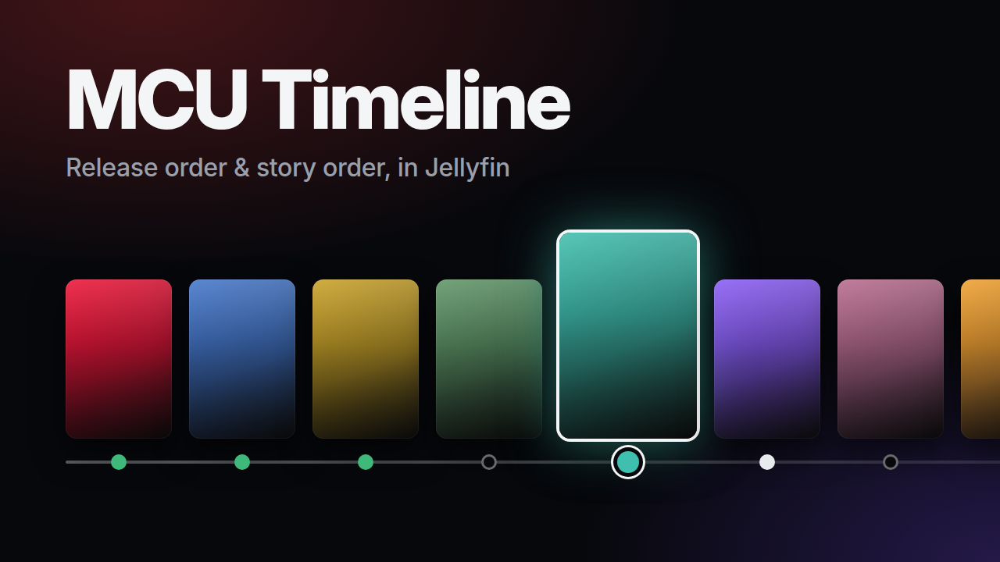

# MCU Timeline



A Jellyfin plugin that shows the whole Marvel Cinematic Universe on one timeline, in release
order or in story order.

- Every title is there, owned or not. Missing ones show their TMDB poster with a small badge.
- Play, resume or mark as watched straight from the timeline.
- Filter by type (movies, series, shorts), by phase, or to your own library.
- Request missing titles through Jellyseerr, if you use it.
- Two playlists, release order and story order, for TV and mobile apps.
- In English or French, following the Jellyfin display language.

Requires Jellyfin 10.11.

## Install

1. In Dashboard, Plugins, Repositories, add
   `https://raw.githubusercontent.com/KassFlute/jellyfin-plugin-mcu-timeline/main/manifest.json`
2. Install **MCU Timeline** from the catalogue.
3. For the timeline page, also add `https://www.iamparadox.dev/jellyfin/plugins/manifest.json`
   and install **Plugin Pages** and **File Transformation**.
4. Restart Jellyfin.
5. In the MCU Timeline settings, tick "Show the timeline under Media in the side menu".

Without Plugin Pages the plugin still keeps the playlists.

## Settings

- **Libraries**: where to look for the titles. All movie and show libraries by default.
- **Jellyseerr**: address and API key, to get a Request button on missing titles. Requests go
  out as the Jellyseerr user linked to the Jellyfin account.
- **Playlists**: owner and names. Both playlists are visible to every user, play state stays
  per user.

The settings page also lists the titles it could not find in the library.

## Data

The timeline lives in
[`mcu-timeline.json`](src/Jellyfin.Plugin.McuTimeline/Data/mcu-timeline.json). Titles are matched
by TMDB id, then IMDb id, never by name.

To fix something without waiting for a release, copy that file to
`<config>/plugins/configurations/mcu-timeline.json` and edit it. It replaces the shipped data
while it is valid, without a restart.

## Build

```
dotnet test tests/Jellyfin.Plugin.McuTimeline.Tests
./scripts/package.sh
```

The zip lands in `artifacts/`. Unzip it into `<config>/plugins/` and restart Jellyfin.

To publish a version, create a GitHub release tagged with it, for example `1.0.1.0`. The
release workflow attaches the zip and adds the version to `manifest.json`.

## License

GPL-3.0
